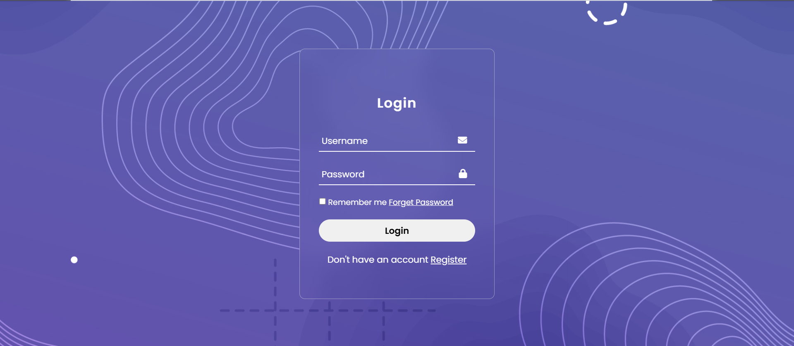

# Login Form - Interface de Login

Um formulário de login simples e elegante, desenvolvido com HTML, CSS e ícones do Font Awesome. Esse projeto visa criar uma experiência de login visualmente atraente e fácil de usar.

## Tecnologias Utilizadas
- **HTML5**: Estrutura básica do formulário.
- **CSS3**: Estilização do layout e design responsivo.
- **Font Awesome**: Para adicionar ícones ao formulário, como o ícone do envelope e do cadeado.

## Instalação
Siga os passos abaixo para rodar o projeto localmente:

1. **Clone este repositório**:
 ```bash
git clone https://github.com/vanvilas/login-form.git
```
2. Abra o arquivo index.html no seu navegador.

## Funcionalidades Futuras
- Adicionar validação de campos com JavaScript.
- Criar uma versão responsiva para dispositivos móveis.

## Captura de Tela


## Autor
- Vanessa Vilas Boas

## Licença
Este projeto está licenciado sob a licença [MIT](LICENSE).
